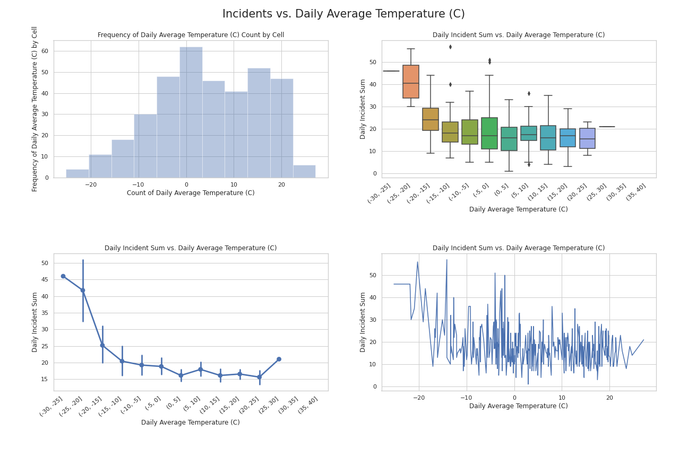
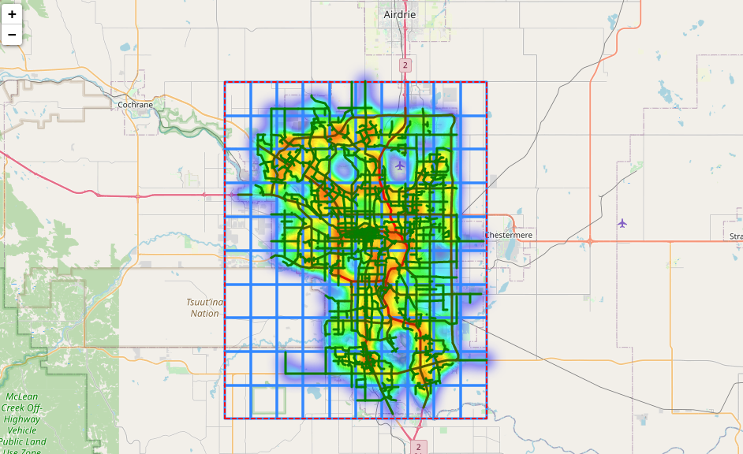
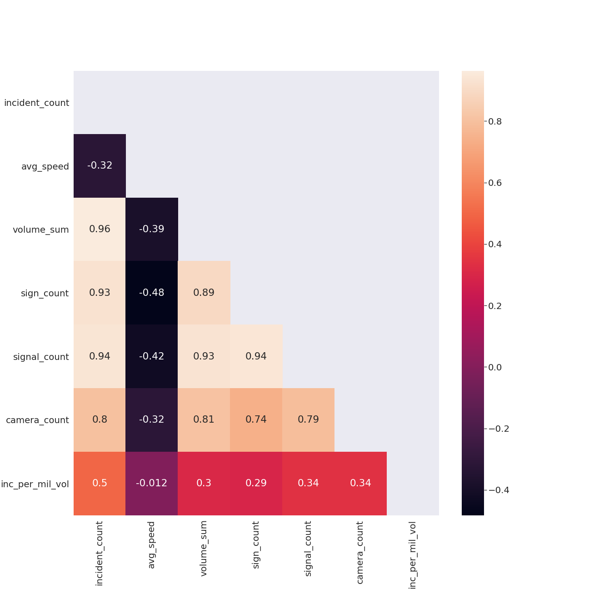
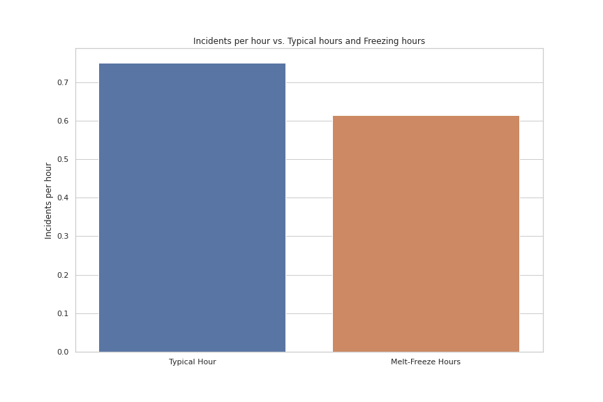

# Calgary Accident Analysis
## By: Mike Lasby
## Last Updated: Jan 26, 2021

Analysis of Calgary car accidents using Pandas, Numpy, seaborn, folium, and geojson. Data publicly available from `data.calgary.ca/browse` and `climate.weather.gc.ca`. See pdf report for analysis and view.ipynb for jupyter notebook presentation.

# Sample plots: 

## Traffic volume 

## Correlation Heatmap

## Melt Freeze Analysis
